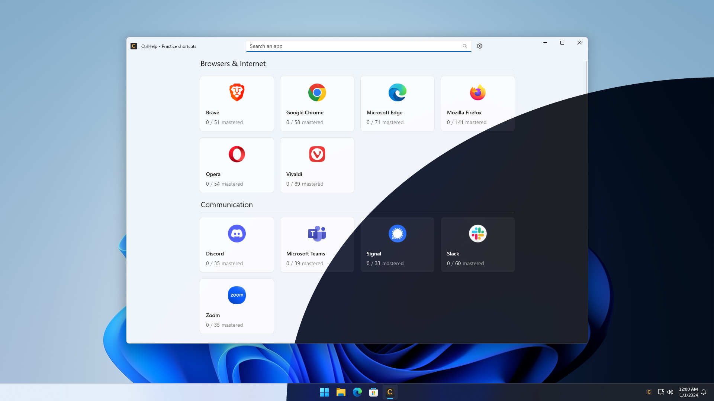
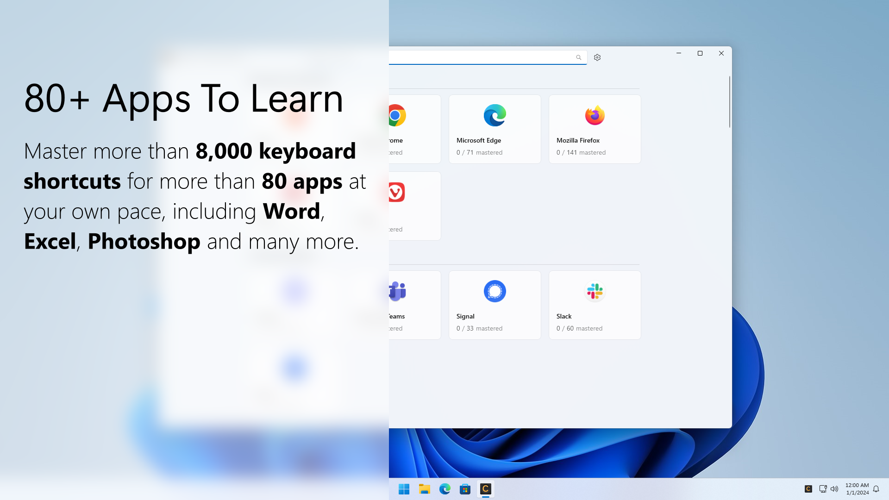
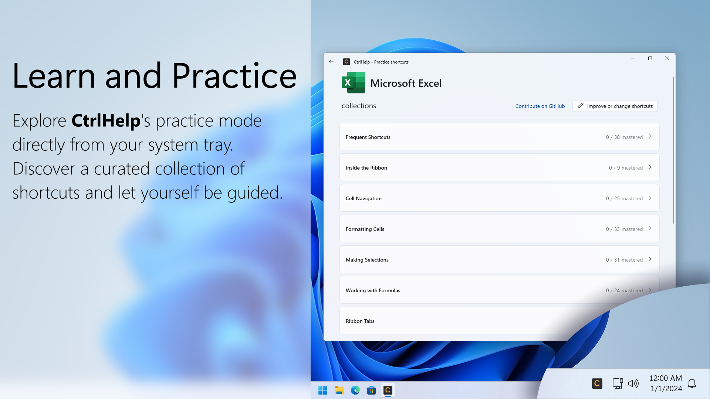
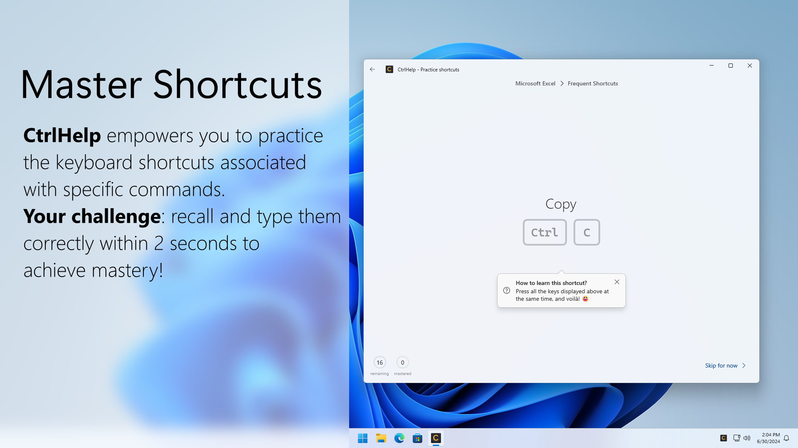
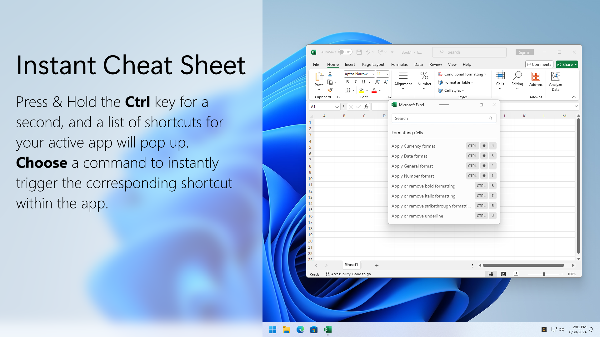
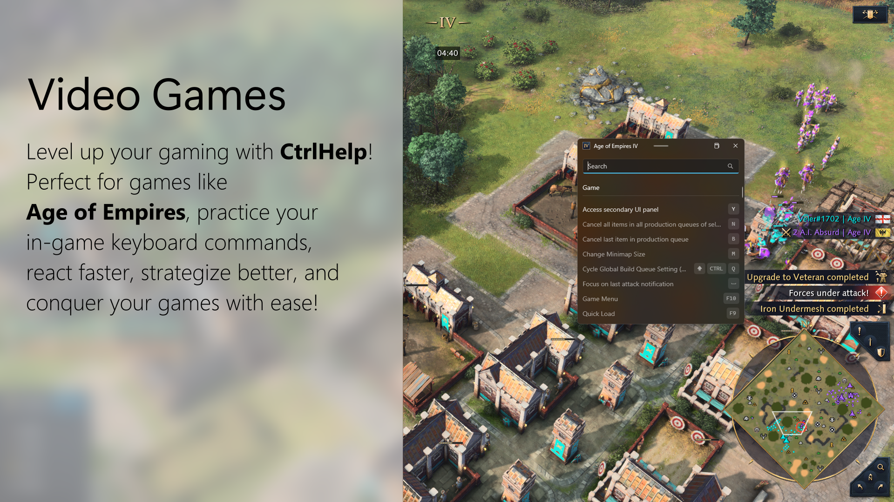
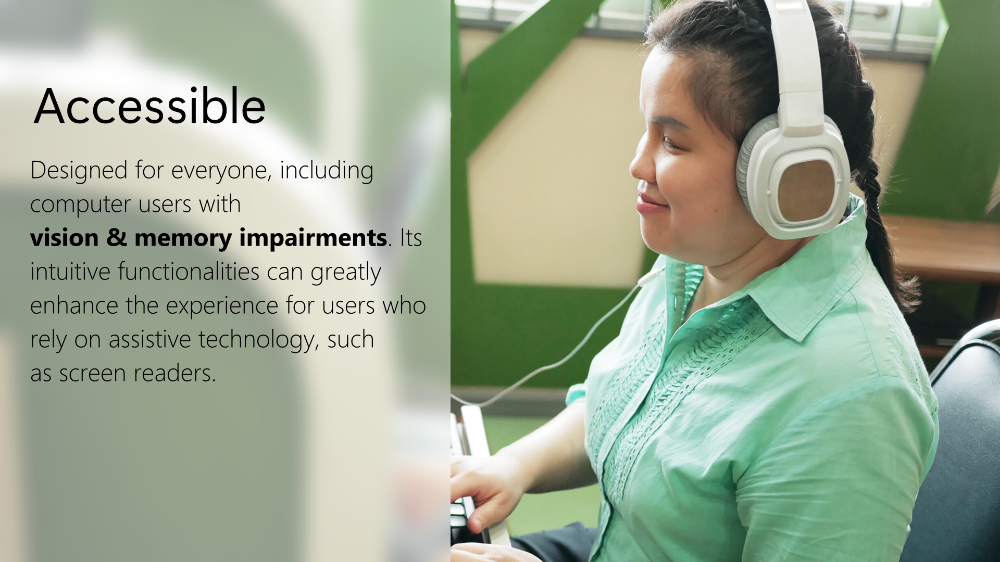
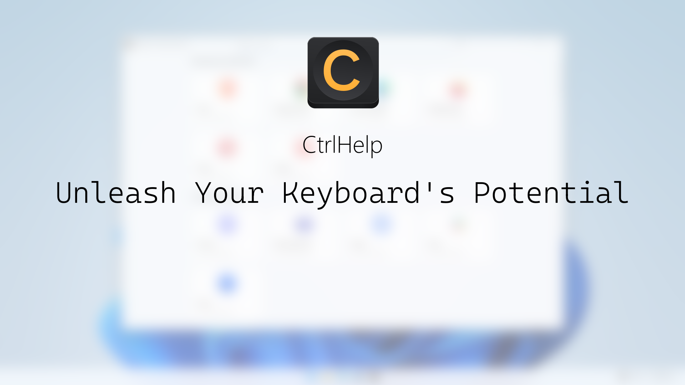

  

<h1 align="center">
  CtrlHelp
</h1>

  Unleash Your Keyboard's Potential

  

## Introduction

Are you tired of navigating through menus and making countless mouse clicks? Say hello to CtrlHelp, your ultimate shortcut companion! Whether you're a productivity guru, a gamer, a computer novice, or someone with vision impairment, CtrlHelp empowers you to master over 80 application shortcuts effortlessly. Inspired by the gamified approach of language learning apps, CtrlHelp offers a unique experience tailored to keyboard shortcuts. Here's why you'll love it:

### Learn and Practice Shortcuts

With CtrlHelp's interactive practice mode, you can explore shortcuts for popular apps like Word, Excel, Photoshop, JetBrains, Visual Studio, Age of Empires, and more, right from your system tray. Become a keyboard wizard at your own pace!

### Instant Cheat Sheet

Forgot a shortcut? No problem! Simply hold the Ctrl key, and a list of shortcuts for your active app appears. Select a command, and voilà—you've harnessed the power of shortcuts without disrupting your workflow.

### Accessibility for All

CtrlHelp is more than just a productivity tool. It’s a powerful ally for those with vision and memory disorders. Its intuitive design and functionality can significantly enhance the computing experience for users who rely on screen readers or have difficulty memorizing commands.

### A Growing List of Supported Apps
With over 80 apps, video games, and 8,000 shortcuts, CtrlHelp covers a wide range of software categories.

Browsers & Internet
- Brave
- Google Chrome
- Microsoft Edge
- Mozilla Firefox
- Opera
- Vivaldi

Communication
- Discord
- Microsoft Teams
- Signal
- Slack
- Zoom

Development & Coding
- Android Studio
- Brackets
- Eclipse
- FileZilla
- Fork
- GitHub Desktop
- GitKraken
- Google Chrome Devtools
- JetBrains Cilion
- JetBrains GoLand
- JetBrains IntelliJ IDEA
- JetBrains PhpStorm
- JetBrains PyCharm
- JetBrains Rider
- JetBrains RubyMine
- Microsoft Visual Studio
- Microsoft Visual Studio Code
- Notepad++
- RStudio
- Spyder
- Sublime Text
- Unity

Digital Audio Workstations (DAWs)
- Ableton Line
- Cubase
- Reaper
- Soundly

Graphics & Design
- Adobe After Effects
- Adobe Illustrator
- Adobe Photoshop
- Adobe Premier Pro
- Affinity Photo
- Blender
- Capture One
- DaVinci Resolve
- Figma
- GIMP
- Inkscape
- Microsoft Photos

Media Players
- AIMP
- foobar2000
- Spotify
- TIDAL
- VLC Media Player

Miscellaneous
- AkelPad
- Files
- Microsoft File Explorer
- Microsoft Windows
- Microsoft Windows Terminal
- OBS Studio
- Wavebox

Productivity & Office
- Adobe Acrobat
- Evernote
- Foxit PDF Reader
- Mendeley Reference Manager
- Microsoft Excel
- Microsoft OneNote
- Microsoft Outlook
- Microsoft PowerPoint
- Microsoft Word
- Mozilla Thunderbird
- Notion
- Obsidian
- Trello
- Typora

Utilities & Tools
- 1Password
- Directory Opus
- Dynalist
- FontCreator
- FreeCommander XE
- Microsoft Calculator
- Microsoft StickyNotes
- Microsoft To Do
- mRemoteNG
- MusicBee
- Snagit
- TickTick
- Todoist

Video Games
- Age of Empires II Definitive Edition
- Age of Empires IV

## Getting Started

To get started with CtrlHelp, simply download the application from the [Microsoft Store website](https://apps.microsoft.com/detail/CtrlHelp/9mvpjxnskdrr?mode=full) and install it on your Windows 10 or Windows 11 device. There is a free trial.

## How to Contribute

We welcome contributions from the community! Whether you have a feature request, want to suggest an enhancement, or have found a bug, your input is valuable to us. Please use the issue templates provided in this repository to submit your contributions:

- [Feature Request](https://github.com/veler/CtrlHelpApp/issues/new/choose): Suggest a new feature or a new app's keyboard shortcut.
- [Enhancement Request](https://github.com/veler/CtrlHelpApp/issues/new/choose): Propose improvements to existing features.
- [Bug Report](https://github.com/veler/CtrlHelpApp/issues/new/choose): Report any bugs or issues you encounter while using CtrlHelp.

For general questions about CtrlHelp, please visit our [GitHub discussions](https://github.com/veler/CtrlHelp/discussions).

If you wish to do the work of adding/editing a shortcut yourself, you can use the [CtrlHelp Editor](Tools/CtrlHelpEditor) tool.

## Documentation

For more information about using CtrlHelp, please refer to the following documents:

- [Terms of Use](TERM-AND-CONDITIONS.md): Understand the terms and conditions of using CtrlHelp.
- [Privacy Policy](PRIVACY-POLICY.md): Learn how we collect, use, and protect your information.

## License

CtrlHelp is a closed source software. However, the default list of apps and their shortcuts supported in CtrlHelp is open-source, licensed under the [MIT License](LICENSE).

Thank you for using CtrlHelp!

## Screenshots

